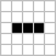
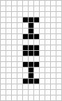

# Celulární automaty


Cílem třetího cvičení v předmětu BIN je seznámit se s technikou celulárního programování, jejími vybranými aplikacemi a dále s využitím evolučních algoritmů ve spojení s celulárními automaty k řešení různých problémů.

Výstupem tohoto cvičení bude jeden PDF soubor (xlogin00.pdf) a program pro evoluci s implementovanou funkcí fitness (ca_gp.cpp).

## Celulární automaty
Celulární automaty (CA) jsou dynamické systémy tvořené diskrétní soustavou __buněk__, z nichž každá se může v daném okamžiku nacházet v jednom stavu z konečné množiny stavů. Stavy buněk jsou aktualizovány synchronně v diskrétních časových krocích. Následující stav každé buňky je určen jejím __lokálním přechodovým pravidlem__ a závisí na stavu dané buňky a na stavech buněk v definovaném __sousedství__ této buňky. __Konfigurací__ celulárního automatu nazýváme hodnoty stavů všech jeho buněk v daném okamžiku. __Vývojový krok__ CA reprezentuje výpočet nových stavů všech jeho buněk na základě lokálních přechodových pravidel.


### Dělení CA
Celulární automaty můžeme rozdělit podle několika hledisek:

* Podle dimenze buněčné struktury na jednorozměrné (1D), dvourozměrné (2D), trojrozměrné (3D) atd. Nejčastěji se používají 1D a 2D celulární automaty. Obrázek 2.1a,b ukazuje struktury 1D celulárních automatů, struktura 2D CA je na obrázku 2.1c.
* Podle lokálních přechodových pravidel buněk. Jsou-li lokální přechodová pravidla všech buněk totožná, jedná se o __uniformní__ celulární automat, v opačném případě hovoříme o __neuniformním,__ případně hybridním CA.


Obrázek 2.1: Vybrané struktury celulárních automatů

V případě konečného počtu buněk automatu je třeba definovat tzv. __okrajové podmínky__, které jednoznačně určují všechny sousedy buněk na hranici celulární struktury. Nejčastěji používané jsou následující přístupy:

* Konstantní okrajové podmínky &#8211; &#8222;chybějící&#8220; sousedy hraničních buněk představují virtuální buňky s pevně zvolenými stavy. Speciálním případem těchto podmínek jsou nulové okrajové podmínky, kdy mají tyto virtuální buňky implicitně nastaveny stav 0.
* Cyklické okrajové podmínky &#8211; protilehlé hraniční buňky jsou pomyslně spojeny, tj. levým sousedem první buňky 1D celulárního automatu je jeho poslední buňka a naopak. 1D CA tak dostává podobu kružnic


Rozsah sousedství u 1D CA je specifikován parametrem zvaným __rádius (R)__ udávající počet buněk vlevo a vpravo od dané buňky, které tvoří její sousedství. Příklad sousedství dané parametrem R=2 je na obrázku 2.2a.

U 2D celulárních automatů se používají nejčastěji tyto dva typy sousedství:

* Von Neumannovo - zahrnuje bezprostředního horního, dolního, levého a pravého souseda dané buňky a tuto buňku samotnou (obrázek 2.2b).
* Moorovo - zahrnuje buňky von Neumannova sousedství a navíc bezprostřední sousedy buňky v diagonálních směrech (obrázek 2.2c).

[[File:Ca neigh.png]]
Obrázek 2.2: Typy sousedství celulárních automatů

## Hra života (Conway's Game of Life)
Hra života (Conway's Game of Life) je uniformní dvourozměrný celulární automat využívající Moorova okolí. Každá z buněk se může nacházet v jednom ze dvou stavů &#8211; živá nebo mrtvá. Následující stav buňky tedy závisí na jejím aktuálním stavu a na stavu osmi okolních buněk. Pro buňky jsou definována následující pravidla:

1. Živá buňka s méně než dvěma živými sousedy umírá (underpopulation).
1. Živá buňka se dvěma nebo třemi živými sousedy zůstává živá.
1. Živá buňka s více než třemi živými sousedy umírá (overpopulation).
1. Mrtvá buňka s právě třemi živými sousedy ožívá (reproduction).

### Základní typy vzorů
#### Still lifes

| Block  |    Beehive | Loaf  |  Boat |
| :---:   |     :---:      |   :---: | :---: |
|  |  |  |  |


#### Oscillators


| Blinker | Toad | Beacon | Pulsar | Pentadecathlon | 
| :---:   |     :---:      |   :---: | :---: |  :---: | 
|  |  |  |  |  |

#### Spaceships

|Glider  |Lightweight spaceship |
| :---:   |     :---:      | 
|  |  |

#### Guns
* [Gosper Glider Gun](https://copy.sh/life/?pattern=gosperglidergun)
* [Bigun](https://copy.sh/life/?pattern=bigun)

#### Puffers
pohybující se vzory, které za sebou nechávají stopu
* [Block laying switch engine](https://copy.sh/life/?pattern=blocklayingswitchengine)
* [Puffer1](https://copy.sh/life/?pattern=puffer1)

#### Složitější útvary
* Hodiny [simulace](https://copy.sh/life/?gist=f3413564b1fa9c69f2bad4b0400b8090&step=512) [Vysvětlení](http://codegolf.stackexchange.com/questions/88783/build-a-digital-clock-in-conways-game-of-life/111932#111932)
* Turingův stroj [Simulace](https://copy.sh/life/?pattern=turingmachine) [Vysvětlení](https://www.ics.uci.edu/~welling/teaching/271fall09/Turing-Machine-Life.pdf)

###  Úkol do zprávy
Nakreslete v [simulátoru](https://bitstorm.org/gameoflife/) 4 glidery, kdy každý půjde jiným směrem (severovýchodním, jihovýchodním, jihozápadním a severozápadním) a vložte výřez z obrazovky s řešením do zprávy.

## Hledání výchozí konfigurace

Vaším úkolem bude doimplementovat genetický algoritmus, který se snaží najít vhodný počáteční stav pro CA řešící Game of Life tak, aby se za 1 až 20 kroků došlo k požadovanému stavu všech buněk. 

### Postup
Stáhněte si kostru projektu z tohoto repozitáře. Bude se pracovat s mřížkou 8x8 s cyklickým propojením buněk. 

Vstupní konfigurace je deklarovaná v přední části souboru `ca_gp.cpp`. S vytvářením počáteční konfigurace vám pomůže [online simulátor](http://www.fit.vutbr.cz/~mrazek/bin_gol/)
```c
// ocekavany vstup
const int expected[rows * cols] = {
   0, 0, 0, 0, 0, 0, 0, 0, 
   0, 0, 0, 0, 0, 0, 0, 0, 
   0, 0, 0, 0, 1, 0, 0, 0, 
   0, 0, 0, 0, 0, 1, 0, 0, 
   0, 0, 0, 1, 1, 1, 0, 0, 
   0, 0, 0, 0, 0, 0, 0, 0, 
   0, 0, 0, 0, 0, 0, 0, 0, 
   0, 0, 0, 0, 0, 0, 0, 0
};
```

Vaším úkolem bude doimplementovat funkci `calculate_fitness`. Simulace je implementovaná v objektu `CAsim & sim`. Budou se vám hodit funce `sim.set_init, sim.run_sim` a `sim.get_states`. Fitness by měla zkontrolovat všechny stavy po všech krocích (ne však počáteční 0) a vybrat ten, který nejvíce odpovídá požadovanému výstupu.


Projekt se spouští pomocí příkazů

```bash
make
./ca_gp
```

Ve výsledku by se měla napsat nalezená počáteční konfigurace ve formátovaném výstupu a v JSON formátu. Druhý formát slouží k načtení v [online simulátoru](http://www.fit.vutbr.cz/~mrazek/bin_gol/). Pokud provedete počet kroků, který vám evoluce vypsala, měli byste se dostat k požadovanému stavu.

Pozn: evoluce nemusí vždy najít řešení.


## Úkoly do zprávy
### Game of Life
* Nakreslete v [simulátoru](https://bitstorm.org/gameoflife/) 4 glidery, kdy každý půjde jiným směrem (severovýchodním, jihovýchodním, jihozápadním a severozápadním) a vložte výřez z obrazovky s řešením do zprávy.

### Hledání výchozí konfigurace
* Nakreslete ve webovém nástroji libovolné (jedné) implementace následujících útvarů a vložte jej jako požadovaný výsledný stav 8x8 automatu
   * Glideru
   * Statické součásti
   * Oscilátoru
* Každou evoluci pusťte 5x (celkem tedy 15 běhů)
* Vyhodnoťte do tabulky pro každý běh: zda se podařilo najít řešení, kolik generací to trvalo, v jakém kroku simulace se došlo u výsledného počátečního řešení k požadovanému výsledku
* Vyhodnoťte průměrný počet evaluací (kolik jedinců jste otestovali: průměrný počet generací k nalezení * lambda) a porovnejte jej s celým stavovým prostorem pro mřížku 8x8. Jakou část prostoru jsme museli prohledat?
* Vložte jedno výsledné řešení pro každý z obrazců ve formátu JSON do webového simulátoru a proveďte patřičný počet kroků - některé kroky zaznamenejte (výřezem z obrazovky) a vložte jako obrázek do zprávy.


## Pro zájemce (DOPORUČENO)
Můžete si stáhnou simulátor [BiCAS](https://github.com/bidlom/BiCAS-Showroom) od Dr. Michala Bidla a zkusit si spustit experimenty. Stačí vždy spustit soubory run - např. `sh BUT-logo.run`. Je nutné mít Python2 a rozhraní pygame (`pip install --user pygame` nebo `sudo apt install python-pygame`) a soubor `BiCAS.py` mít jako spustitelný)


## Literatura
* Sipper, M.: Evolution of Parallel Cellular Machines, Lecture Notes in Computer Science, vol 1194, Springer-Verlag, Berlin Heidelberg New York, 1997. Dostupná [zde](http://www.cs.bgu.ac.il/~sipper/papabs/epcm.pdf).
* Wolfram, S.: A New Kind of Science, Wolfram Media Inc., 2002. Dostupná [zde](http://www.wolframscience.com/nksonline/toc.html).
* Bidlo, M.: Generování grafů celulárními automaty, [Technická zpráva], UPSY FIT VUT v Brně, 2005. Dostupná [zde](http://www.fit.vutbr.cz/research/view_pub.php?id=8296).