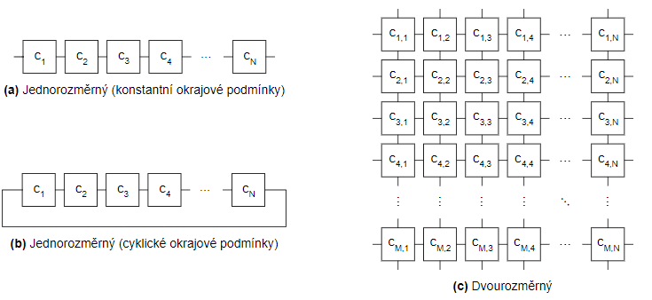

# Laboratorní cvičení BIN3 : Celulární automaty


## Celulární automaty
Celulární automaty (CA) jsou dynamické systémy tvořené diskrétní soustavou __buněk__, z nichž každá se může v daném okamžiku nacházet v jednom stavu z konečné množiny stavů. Stavy buněk jsou aktualizovány synchronně v diskrétních časových krocích. Následující stav každé buňky je určen jejím __lokálním přechodovým pravidlem__ a závisí na stavu dané buňky a na stavech buněk v definovaném __sousedství__ této buňky. __Konfigurací__ celulárního automatu nazýváme hodnoty stavů všech jeho buněk v daném okamžiku. __Vývojový krok__ CA reprezentuje výpočet nových stavů všech jeho buněk na základě lokálních přechodových pravidel.


### Dělení CA
Celulární automaty můžeme rozdělit podle několika hledisek:

* Podle dimenze buněčné struktury na jednorozměrné (1D), dvourozměrné (2D), trojrozměrné (3D) atd. Nejčastěji se používají 1D a 2D celulární automaty. Obrázek 2.1a,b ukazuje struktury 1D celulárních automatů, struktura 2D CA je na obrázku 2.1c.
* Podle lokálních přechodových pravidel buněk. Jsou-li lokální přechodová pravidla všech buněk totožná, jedná se o __uniformní__ celulární automat, v opačném případě hovoříme o __neuniformním,__ případně hybridním CA.


Obrázek 2.1: Vybrané struktury celulárních automatů

V případě konečného počtu buněk automatu je třeba definovat tzv. __okrajové podmínky__, které jednoznačně určují všechny sousedy buněk na hranici celulární struktury. Nejčastěji používané jsou následující přístupy:

* Konstantní okrajové podmínky &#8211; &#8222;chybějící&#8220; sousedy hraničních buněk představují virtuální buňky s pevně zvolenými stavy. Speciálním případem těchto podmínek jsou nulové okrajové podmínky, kdy mají tyto virtuální buňky implicitně nastaveny stav 0.
* Cyklické okrajové podmínky &#8211; protilehlé hraniční buňky jsou pomyslně spojeny, tj. levým sousedem první buňky 1D celulárního automatu je jeho poslední buňka a naopak. 1D CA tak dostává podobu kružnic


Rozsah sousedství u 1D CA je specifikován parametrem zvaným __rádius (R)__ udávající počet buněk vlevo a vpravo od dané buňky, které tvoří její sousedství. Příklad sousedství dané parametrem R=2 je na obrázku 2.2a.

U 2D celulárních automatů se používají nejčastěji tyto dva typy sousedství:

* Von Neumannovo - zahrnuje bezprostředního horního, dolního, levého a pravého souseda dané buňky a tuto buňku samotnou (obrázek 2.2b).
* Moorovo - zahrnuje buňky von Neumannova sousedství a navíc bezprostřední sousedy buňky v diagonálních směrech (obrázek 2.2c).


Obrázek 2.2: Typy sousedství celulárních automatů

## Hra života (Conway's Game of Life)
Hra života (Conway's Game of Life) je uniformní dvourozměrný celulární automat využívající Moorova okolí. Každá z buněk se může nacházet v jednom ze dvou stavů &#8211; živá nebo mrtvá. Následující stav buňky tedy závisí na jejím aktuálním stavu a na stavu osmi okolních buněk. Pro buňky jsou definována následující pravidla:

1. Živá buňka s méně než dvěma živými sousedy umírá (underpopulation).
1. Živá buňka se dvěma nebo třemi živými sousedy zůstává živá.
1. Živá buňka s více než třemi živými sousedy umírá (overpopulation).
1. Mrtvá buňka s právě třemi živými sousedy ožívá (reproduction).

### Základní typy vzorů
#### Still lifes

| Block  |    Beehive | Loaf  |  Boat |
| :---:   |     :---:      |   :---: | :---: |
|  |  |  |  |


#### Oscillators


| Blinker | Toad | Beacon | Pulsar | Pentadecathlon | 
| :---:   |     :---:      |   :---: | :---: |  :---: | 
|  |  |  |  |  |

#### Spaceships

|Glider  |Lightweight spaceship |
| :---:   |     :---:      | 
|  |  |

#### Guns
* [Gosper Glider Gun](https://copy.sh/life/?pattern=gosperglidergun)
* [Bigun](https://copy.sh/life/?pattern=bigun)

#### Puffers
pohybující se vzory, které za sebou nechávají stopu
* [Block laying switch engine](https://copy.sh/life/?pattern=blocklayingswitchengine)
* [Puffer1](https://copy.sh/life/?pattern=puffer1)

#### Složitější útvary
* Hodiny [simulace](https://copy.sh/life/?gist=f3413564b1fa9c69f2bad4b0400b8090&step=512) [Vysvětlení](http://codegolf.stackexchange.com/questions/88783/build-a-digital-clock-in-conways-game-of-life/111932#111932)
* Turingův stroj [Simulace](https://copy.sh/life/?pattern=turingmachine) [Vysvětlení](https://www.ics.uci.edu/~welling/teaching/271fall09/Turing-Machine-Life.pdf)


# Samostatná práce
V tomto cvičení budete hledat přechodová pravidla pro 1D celulární automat, který bude řešit problém __majority__. Genetický algoritmus ve variantě (μ+λ) (neboli μ rodičů a λ potomků) již máte připravený. Vaším úkolem bude doplnit simulátor, který pro daného jedince `Individual` spočítá jeho fitness hodnotu. Evoluční algoritmus se bude snažit tuto fitness maximalizovat.

Pro ladění řešení máte připravený [online simulátor](http://mrazekv.github.io/bin-ca-sim), kam můžete nakopírovat vypsaného jedince ve formátu JSON (`std::cout << population[0] << std::endl`). Poté můžete simulovat chování.

Můžete začít tím, že si stáhnete všechny potřebné soubory. Kostra projektu je odladěná pro Linuxové systémy a měly by fungovat na školních serverech.

```
git clone https://github.com/mrazekv/bin-lab-ca.git
cd bin-lab-ca
```


## Příprava
Vaším úkolem bude modifikovat výpočet fitness funkce tak, aby funkce řešila úkol majority. Nejlepší fitness tak budou mít pravidla, která vedou nejblíže k majoritě. Budete zasahovat zejména do souboru [simulator.hpp](simulator.hpp). 

Doplníte výpočet fitness funkce. Simulace jednoho počátečního stavu `state` probíhá tak, že do 1D pole `buffer[0]` nahrajeme počáteční stav `data[state]`. Dále pro fixní počet kroků `step` pro každou buňku pomocí přechodových pravidel vypočítáme výsledek do `buffer[1]`. Okrajové buňky jsou řešeny tak, že dochází __k replikaci krajních buněk__.

Na závěr každého kroku prohodíme 1D pole (řešeno indexy `current` a `future`).

## Spuštění
```
make
./ca_majority
```

## Úkol 1: základní fitness
Navrhněte fitness tak, že pro všechy stavy simulujete všechny kroky. Vypočítáte, kolik buněk v _nejlepším kroku_ odpovídalo očekávané hodnotě definované v `expected[state]`. Pokud úplně všechny buňky odpovídaly očekávané hodnotě, nepřičítejte do fitness pouze číslo `cells`, ale zaveďte bonus `10 * cells`. 

### Otázky:
- Podařilo se dosáhnout vysoké fitness?
- Co by se stalo, pokud by nebyl zaveden bonus?
- Proč je tato implementace nevhodná (simulujte řešení v simulátoru)


## Úkol 2: stabilní řešení
Upravte výpočet fitness tak, že počítáte pouze stabilní CA (tj. poslední dva stavy jsou stejné, porovnávat můžete pomocí `std::equal`). Pro stabilní stav vypočtěte fitness stavu podle počtu buněk shodných s očekávanou hodnotou. Pokud jsou všechny stejné a odpovídají očekávané, přičtěte bonus. Pokud se neskončilo stabilní konfigurací, k fitness nic nepřičítejte.

### Otázky:
- Podařilo se dosáhnout vysoké fitness?

## Úko 3: odstranění bonusu
- Co by se stalo, __pokud by nebyl zaveden bonus__?
